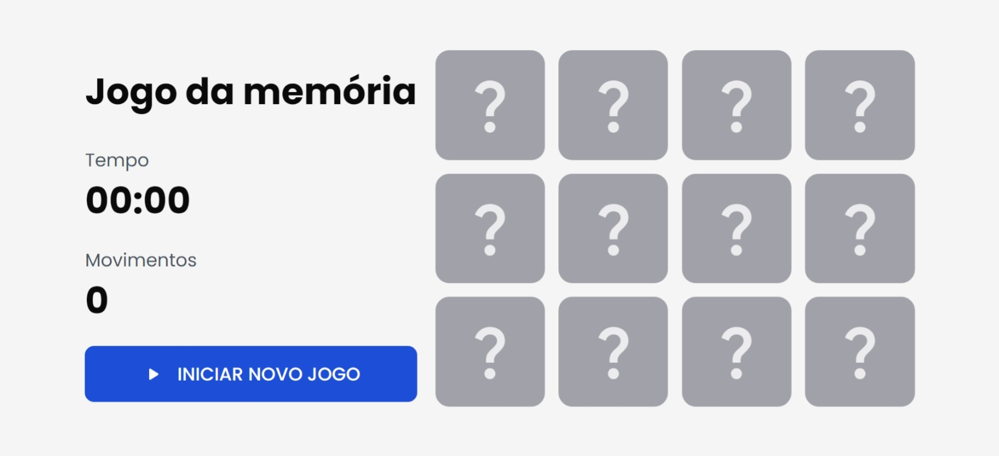

# Jogo da memória

Jogo da memória é um jogo simples e divertido que testa a sua capacidade de memorizar e encontrar pares de imagens iguais.

O objetivo do jogo é virar todas as cartas do tabuleiro, formando os pares correspondentes, no menor tempo e com o menor número de movimentos possíveis.

## 🎨 Design



## 💻 Tecnologias utilizadas

- ⚡ [Vite](https://vitejs.dev/) para um desenvolvimento rápido e eficiente.
- ⚛️ [React](https://reactjs.org/) para uma interface interativa e responsiva.
- 💼 [TypeScript](https://www.typescriptlang.org/) para um código mais seguro e legível.
- 🎨 [styled-components](https://styled-components.com/) para estilização elegante e flexível.

## 🚀 Como executar?

```bash
# Clonar o repositório
$ git clone https://github.com/flaviojeferson/bmi-calc

# Acessar o repositório
$ cd bmi-calc

# Instalar as dependências
$ git install

# Iniciar o projeto
$ npm run dev
```

O app estará disponível no seu browser pelo endereço `http://localhost:3000`.

---

Desenvolvido por **Flávio Jeferson** em outubro de 2023. 💪
